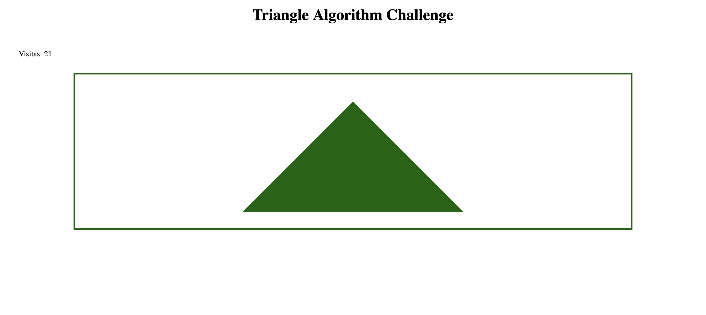

# Desafio Bloco 4

Existem dois arquivos, `style.css` e `index.html` para que vocês utilizem como base.

## Agora é a hora do desafio da pirâmide!

Vocês devem construir todo o algoritmo JavaScript para os arquivos já existentes.

**Sua página deve:**

1. Utilizar o algoritmo de criação de pirâmide de asteriscos para gerar a pirâmide da imagem a seguir.

2. A classe `box` do CSS tem `50px` porque esse CSS está assumindo uma pirâmide de base 9, ou seja, com 5 linhas.

3. Utilize LocalStorage para a criação do contador de visitas;

4. Ter a aparência próxima à imagem abaixo;

5. Atente-se para às classes CSS `.left`, `.right` e `tri-top`. Elas poderão ajudar na criação da sua pirâmide;

6. Lembre-se de utilizar funções.

## Orientações de criação de Pull Request:

A `branch` da equipe deve conter o nome de cada pessoa do grupo. `lucas-joao-ricardo-...`

O resto é com vocês!

**Divirtam-se!**
